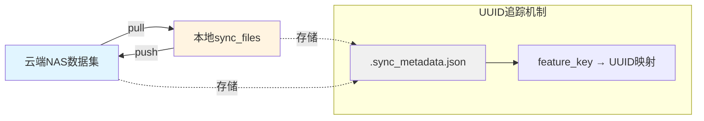

# utils说明

## file_sync.py

文件同步工具，支持在云端NAS和本地sync_files之间双向同步数据，使用UUID追踪机制确保数据一致性和增量更新。

### 工作原理



### 核心概念

- **Pull**: 从云端NAS拉取数据到本地 `sync_files/[dataset_name]/`
- **Push**: 从本地sync_files推送数据到云端NAS
- **UUID追踪**: 每个feature_key有唯一UUID，通过比对UUID判断是否需要同步
- **增量更新**: 只同步UUID不匹配的数据，避免不必要的文件传输

### 配置

在 [`config.py`](../config.py) 中设置 `ROBOCOIN_PIPELINE_DISTRIBUTION_MODE`:
- `0`: 本地开发模式（禁用同步）
- `1`: 集群分布式模式（启用同步）

在 [`feature_key.yaml`](feature_key.yaml) 中配置feature_key与文件路径的映射关系。

### API使用

#### pull_files - 从云端拉取数据

```python
from robocoin_pipeline.utils.file_sync import pull_files

# 从云端NAS拉取指定feature的数据到本地sync_files
pull_files(
    repo_path="/mnt/nas/synnas/docker2/robocoin-datasets/unitree_g1_basket_storage_peach",
    feature_keys=["scenec_annotation"],
)
```

**执行流程**:
1. 检查云端是否有 `.sync_metadata.json`，如果没有则为所有feature_key初始化UUID
2. 比对云端和本地的UUID
3. 只拉取UUID不匹配或本地无数据的feature

#### push_files - 推送数据到云端

```python
from robocoin_pipeline.utils.file_sync import push_files

# 将本地sync_files的数据推送到云端NAS
push_files(
    repo_path="/mnt/nas/synnas/docker2/robocoin-datasets/unitree_g1_basket_storage_peach",
    feature_keys=["scenec_annotation"],
)
```

**执行流程**:
1. 为云端metadata中不存在的新feature_key初始化UUID
2. 比对云端和本地的UUID
3. 只推送UUID不匹配的feature，并更新云端metadata

#### sync_files - 统一同步接口

```python
from robocoin_pipeline.utils.file_sync import sync_files

# Pull模式
sync_files(
    repo_path="/mnt/nas/synnas/docker2/robocoin-datasets/my_dataset",
    feature_keys=["scenec_annotation", "state_action"],
    direction="pull",
)

# Push模式
sync_files(
    repo_path="/mnt/nas/synnas/docker2/robocoin-datasets/my_dataset",
    feature_keys=["scenec_annotation"],
    direction="push",
)
```

### 完整示例

创建文件 `test_sync.py`:

```python
"""测试文件同步功能"""
from pathlib import Path
from robocoin_pipeline.utils.file_sync import pull_files, push_files

# 数据集路径
DATASET_PATH = "/mnt/nas/synnas/docker2/robocoin-datasets/unitree_g1_basket_storage_peach"
FEATURES = ["scenec_annotation"]

def test_pull():
    """测试从云端拉取数据"""
    print("=" * 60)
    print("测试: Pull数据从云端NAS")
    print("=" * 60)
    pull_files(repo_path=DATASET_PATH, feature_keys=FEATURES)
    
    # 验证本地文件
    sync_dir = Path(__file__).parent.parent.parent.parent / "sync_files"
    dataset_name = Path(DATASET_PATH).name
    local_path = sync_dir / dataset_name
    
    print(f"\n本地同步目录: {local_path}")
    print(f"元数据文件: {local_path / '.sync_metadata.json'}")

def test_push():
    """测试推送数据到云端（使用测试目录）"""
    print("\n" + "=" * 60)
    print("测试: Push数据到测试目录")
    print("=" * 60)
    
    # 推送到临时测试目录避免影响真实数据
    test_path = "/tmp/test_nas_dataset/unitree_g1_basket_storage_peach"
    push_files(repo_path=test_path, feature_keys=FEATURES)
    
    print(f"\n测试目录: {test_path}")
    print(f"元数据文件: {test_path}/.sync_metadata.json")

if __name__ == "__main__":
    test_pull()
    test_push()
```

运行测试:
```bash
python test_sync.py
```

### Metadata文件格式

`.sync_metadata.json` 示例:

```json
{
  "scenec_annotation": {
    "uuid": "9654d118-026d-4f28-99a2-559cb9c826e5",
    "created_at": "2025-12-03T22:03:38.021661"
  },
  "state_action": {
    "uuid": "a7b3c8d9-1234-5678-90ab-cdef12345678",
    "created_at": "2025-12-03T22:10:15.123456"
  }
}
```

### 示例目录结构

```plaintext
.
└── RMC-AIDA-L_box_up_down
    ├── dataset_info.yaml
    ├── format_convert
    │   ├── data
    │   │   └── chunk-000
    │   ├── meta
    │   │   ├── info.json
    │   │   └── tasks.jsonl
    │   └── videos
    │       └── chunk-000
    │           ├── observation.images.cam_high_rgb
    │           ├── observation.images.cam_left_wrist_rgb
    │           └── observation.images.cam_right_wrist_rgb
    ├── merged
    │   ├── data
    │   │   └── chunk-000
    │   ├── hardlink_mappings.json
    │   ├── meta
    │   │   ├── annotations
    │   │   │   ├── eef_acc_mag_annotation.jsonl
    │   │   │   ├── eef_direction_annotation.jsonl
    │   │   │   ├── eef_velocity_annotation.jsonl
    │   │   │   ├── gripper_activity_annotation.jsonl
    │   │   │   ├── gripper_mode_annotation.jsonl
    │   │   │   ├── scene_annotations.jsonl
    │   │   │   └── subtask_annotations.jsonl
    │   │   ├── info.json
    │   │   ├── merged_info.json
    │   │   ├── motion_annotation_info.json
    │   │   ├── ori_info.json
    │   │   ├── quality_checked_info.json
    │   │   ├── quality_checked_tasks.jsonl
    │   │   ├── scene_annotation_info.json
    │   │   ├── state_action_info.json
    │   │   ├── subtask_annotation_info.json
    │   │   └── tasks.jsonl
    │   └── videos
    └── motion_annotation
        ├── data
        │   └── chunk-000
        ├── hardlink_mappings.json
        ├── meta
        │   ├── info.json
        │   └── tasks.jsonl
        └── videos

```

### 注意事项

1. **首次使用**: 首次pull会自动初始化所有feature_key的UUID并同步到云端
2. **UUID不可手动修改**: UUID由系统自动管理，手动修改会导致同步异常
3. **增量添加feature**: 新增feature_key时会自动为其初始化UUID
4. **数据安全**: 使用临时文件+原子重命名确保写入安全
5. **跳过机制**: UUID匹配且本地有数据时自动跳过同步，节省时间

### Hardlink/Symlink重建功能

文件同步工具支持自动重建hard links和符号链接，这对于节省存储空间和保持数据一致性非常有用。

#### 工作原理

1. **Pull操作**: 拉取数据后，自动读取 `[feature_key]/hardlink_mappings.json` 文件
2. **自动拉取缺失源文件**: 如果源文件/目录不存在，会自动从云端递归拉取
3. **智能链接创建**:
   - **文件**: 创建hard link（多个文件名指向同一个inode）
   - **目录**: 创建符号链接（使用相对路径）
4. **Push操作**: 推送时自动检测硬链接，跳过已推送的源文件，避免重复传输
5. **容错处理**: 如果无法创建hard link，会自动降级为文件复制

#### hardlink_mappings.json格式

```json
{
  "merged/meta": "format_convert/meta",
  "merged/data/chunk-000": "format_convert/data/chunk-000",
  "merged/videos/observation.images.cam_high_rgb": "format_convert/videos/observation.images.cam_high_rgb"
}
```

- **键**: 目标路径（相对于数据集根目录）
- **值**: 源路径（相对于数据集根目录）
- **支持类型**: 文件使用hard link，目录使用符号链接

#### 使用场景

当多个feature_key共享相同的数据文件或目录时，使用链接可以：
- **节省存储空间**: 文件级hard link不占用额外空间，目录级symlink共享整个目录树
- **保持数据一致性**: 多个路径指向同一份数据
- **提高同步效率**: Push时自动跳过硬链接文件，避免重复上传
- **自动化管理**: Pull时自动拉取缺失的源文件/目录

#### 注意事项

1. **自动拉取**: 源文件/目录缺失时，系统会自动从云端拉取，确保链接创建成功
2. **跨文件系统**: Hard link无法跨文件系统，此时会自动降级为文件复制
3. **JSON格式**: 确保 `hardlink_mappings.json` 是有效的JSON格式（无尾部逗号）
4. **符号链接**: 目录使用相对路径符号链接，移动数据集时链接仍然有效
5. **Push优化**: 系统通过inode检测硬链接，自动跳过重复推送

#### 技术细节

- **文件级链接**: 使用 `Path.hardlink_to()` 创建hard link，共享inode
- **目录级链接**: 使用 `Path.symlink_to()` 创建相对路径符号链接
- **智能检测**: 通过 `st_ino` 比对检测文件是否为硬链接
- **递归拉取**: 使用 `pull_missing_file()` 递归拉取缺失的源文件和目录
- **容错降级**: Hard link创建失败时自动降级为 `shutil.copy2()` 复制
