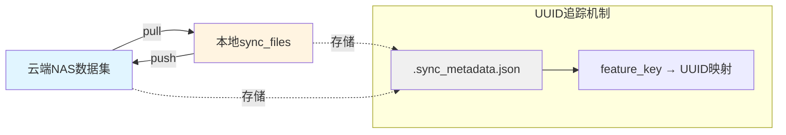

# utils说明

## file_sync.py

文件同步工具，支持在云端NAS和本地sync_files之间双向同步数据，使用UUID追踪机制确保数据一致性和增量更新。

### 工作原理



### 核心概念

- **Pull**: 从云端NAS拉取数据到本地 `sync_files/[dataset_name]/`
- **Push**: 从本地sync_files推送数据到云端NAS
- **UUID追踪**: 每个feature_key有唯一UUID，通过比对UUID判断是否需要同步
- **增量更新**: 只同步UUID不匹配的数据，避免不必要的文件传输

### 配置

在 [`config.py`](../config.py) 中设置 `ROBOCOIN_PIPELINE_DISTRIBUTION_MODE`:
- `0`: 本地开发模式（禁用同步）
- `1`: 集群分布式模式（启用同步）

在 [`feature_key.yaml`](feature_key.yaml) 中配置feature_key与文件路径的映射关系。

### API使用

#### pull_files - 从云端拉取数据

```python
from robocoin_pipeline.utils.file_sync import pull_files

# 从云端NAS拉取指定feature的数据到本地sync_files
pull_files(
    repo_path="/mnt/nas/synnas/docker2/robocoin-datasets/unitree_g1_basket_storage_peach",
    feature_keys=["scenec_annotation"],
)
```

**执行流程**:
1. 检查云端是否有 `.sync_metadata.json`，如果没有则为所有feature_key初始化UUID
2. 比对云端和本地的UUID
3. 只拉取UUID不匹配或本地无数据的feature

#### push_files - 推送数据到云端

```python
from robocoin_pipeline.utils.file_sync import push_files

# 将本地sync_files的数据推送到云端NAS
push_files(
    repo_path="/mnt/nas/synnas/docker2/robocoin-datasets/unitree_g1_basket_storage_peach",
    feature_keys=["scenec_annotation"],
)
```

**执行流程**:
1. 为云端metadata中不存在的新feature_key初始化UUID
2. 比对云端和本地的UUID
3. 只推送UUID不匹配的feature，并更新云端metadata

#### sync_files - 统一同步接口

```python
from robocoin_pipeline.utils.file_sync import sync_files

# Pull模式
sync_files(
    repo_path="/mnt/nas/synnas/docker2/robocoin-datasets/my_dataset",
    feature_keys=["scenec_annotation", "state_action"],
    direction="pull",
)

# Push模式
sync_files(
    repo_path="/mnt/nas/synnas/docker2/robocoin-datasets/my_dataset",
    feature_keys=["scenec_annotation"],
    direction="push",
)
```

### 完整示例

创建文件 `test_sync.py`:

```python
"""测试文件同步功能"""
from pathlib import Path
from robocoin_pipeline.utils.file_sync import pull_files, push_files

# 数据集路径
DATASET_PATH = "/mnt/nas/synnas/docker2/robocoin-datasets/unitree_g1_basket_storage_peach"
FEATURES = ["scenec_annotation"]

def test_pull():
    """测试从云端拉取数据"""
    print("=" * 60)
    print("测试: Pull数据从云端NAS")
    print("=" * 60)
    pull_files(repo_path=DATASET_PATH, feature_keys=FEATURES)
    
    # 验证本地文件
    sync_dir = Path(__file__).parent.parent.parent.parent / "sync_files"
    dataset_name = Path(DATASET_PATH).name
    local_path = sync_dir / dataset_name
    
    print(f"\n本地同步目录: {local_path}")
    print(f"元数据文件: {local_path / '.sync_metadata.json'}")

def test_push():
    """测试推送数据到云端（使用测试目录）"""
    print("\n" + "=" * 60)
    print("测试: Push数据到测试目录")
    print("=" * 60)
    
    # 推送到临时测试目录避免影响真实数据
    test_path = "/tmp/test_nas_dataset/unitree_g1_basket_storage_peach"
    push_files(repo_path=test_path, feature_keys=FEATURES)
    
    print(f"\n测试目录: {test_path}")
    print(f"元数据文件: {test_path}/.sync_metadata.json")

if __name__ == "__main__":
    test_pull()
    test_push()
```

运行测试:
```bash
python test_sync.py
```

### Metadata文件格式

`.sync_metadata.json` 示例:

```json
{
  "scenec_annotation": {
    "uuid": "9654d118-026d-4f28-99a2-559cb9c826e5",
    "created_at": "2025-12-03T22:03:38.021661"
  },
  "state_action": {
    "uuid": "a7b3c8d9-1234-5678-90ab-cdef12345678",
    "created_at": "2025-12-03T22:10:15.123456"
  }
}
```

### 目录结构

```plaintext
robocoin-pipeline/
├── sync_files/                    # 本地同步目录
│   └── [dataset_name]/           # 数据集名称目录
│       ├── .sync_metadata.json   # UUID追踪文件
│       ├── annotations/          # 根据feature_key配置
│       ├── meta/
│       └── scene_annotation_data/
└── /mnt/nas/.../[dataset_name]/  # 云端NAS数据集
    ├── .sync_metadata.json       # UUID追踪文件
    ├── annotations/
    ├── meta/
    └── scene_annotation_data/
```

### 注意事项

1. **首次使用**: 首次pull会自动初始化所有feature_key的UUID并同步到云端
2. **UUID不可手动修改**: UUID由系统自动管理，手动修改会导致同步异常
3. **增量添加feature**: 新增feature_key时会自动为其初始化UUID
4. **数据安全**: 使用临时文件+原子重命名确保写入安全
5. **跳过机制**: UUID匹配且本地有数据时自动跳过同步，节省时间
